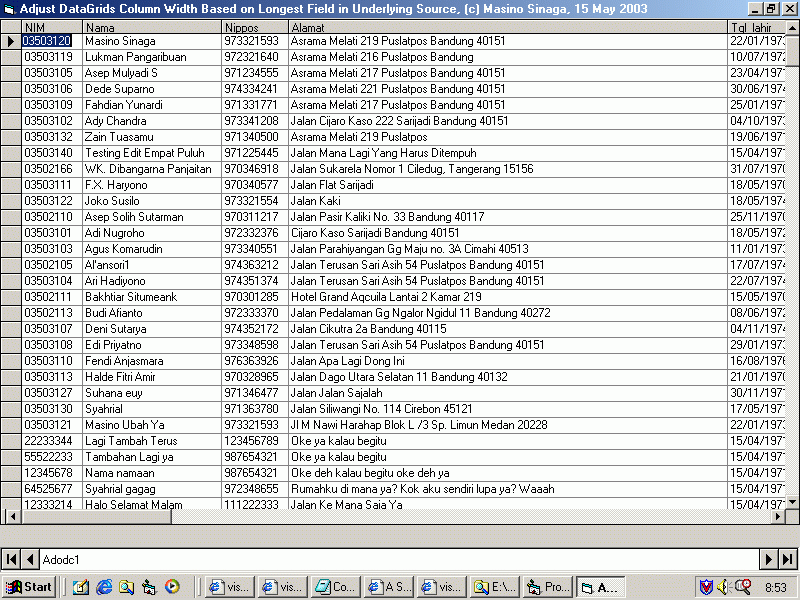



## Adjust DataGrids Column Width Based on Longest Field in Underlying Source

### Description

When you display data from a database to a DataGrid, you will see that DataGrid's columns width cannot adjust to the longest data in the field. I made one procedure that can fix the problem.

This procedure will adjust DataGrids column width

based on longest field in underlying source. Enjoy!!!
 
### More Info
 
When you display data from a database to a DataGrid, you will see that DataGrid's columns width cannot adjust to the longest data in the field. This following procedure can fix the problem.

             |
---                |---
**Submitted On**   |2003-05-15 19:32:28
**By**             |[Masino Sinaga](https://github.com/Planet-Source-Code/PSCIndex/blob/master/ByAuthor/masino-sinaga.md)
**Level**          |Intermediate
**User Rating**    |4.9 (39 globes from 8 users)
**Compatibility**  |VB 6\.0
**Category**       |[Databases/ Data Access/ DAO/ ADO](https://github.com/Planet-Source-Code/PSCIndex/blob/master/ByCategory/databases-data-access-dao-ado__1-6.md)
**World**          |[Visual Basic](https://github.com/Planet-Source-Code/PSCIndex/blob/master/ByWorld/visual-basic.md)
**Archive File**   |[Adjust\_Dat1588255152003\.zip](https://github.com/Planet-Source-Code/masino-sinaga-adjust-datagrids-column-width-based-on-longest-field-in-underlying-source__1-45504/archive/master.zip)

